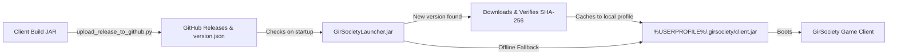

# GirSociety RSPS — OSRS Revision 240 Private Server & Client

[-blue.svg?style=for-the-badge&logo=runescape)](https://github.com/yaitsbilly/gs-rsps-client)

Welcome to **GirSociety**, a premier Old School RuneScape (OSRS) private game server emulator built on a high-performance **OSRS Revision 240** engine (Cache #2664). GirSociety blends authentic, bleeding-edge OSRS content (Varlamore, Sailing #23, Desert Treasure 2, Project Rebalance) with an expansive suite of custom systems, crafting engines, pinnacle bosses, mystery crate codex, unique relics, pets, and quality-of-life enhancements.

---

## 🌟 Key Server Highlights & Features

### ⚔️ 1. Pinnacle Bosses & Custom Encounters (121 Bosses & Mobs)
Experience fully scripted, mechanically accurate pinnacle bosses along with custom world bosses:
* **Varlamore & Modern Encounters**: The Hueycoatl (Custodia Mountain arena, armor-break mechanics), Amoxliatl, Moons of Peril (Blood Moon, Blue Moon, Eclipse Moon), Scurrius, Araxxor, and Tormented Demons.
* **Desert Treasure 2 Bosses**: Vardorvis, Duke Sucellus, The Leviathan, and The Whisperer with complete phase shifts, projectile states, and sanity mechanics.
* **Raids & Pinnacle Bosses**: Tombs of Amascut (ToA), Chambers of Xeric (CoX), Theatre of Blood (ToB), Nex, Corporeal Beast, Alchemical Hydra, Phantom Muspah, Vorkath, Zulrah, and Cerberus.
* **Wilderness & World Bosses**: Artio, Calvar'ion, Spindel, Callisto, Vet'ion, Venenatis, Chaos Elemental, Scorpia, KBD, Revenants, and custom world bosses including *Baby Grashnak, Miniature Treants, Dune Golems, Crypt Scuttlers, Solar Dragons*, and the *Chibi Noxus Titan*.

---

### 🎁 2. Gir-Society Crates Codex (Tiered Mystery Crates)
An interactive unboxing minigame and reward economy integrated across the entire server (`::crates`):
* **5 Crate Tiers**: Bronze Supply, Silver Skilling, Gold Combat, Diamond Boss, and Mythic Celestial.
* **Virtual Key Management**: Players collect and store keys directly on their accounts without consuming inventory space.
* **Animated 60 FPS Carousel Unboxing**: Physics-based deceleration easing, authentic tick sound effects, colored rarity glows (*Common, Uncommon, Rare, Epic, Legendary, Mythic*), and winning item spotlight.
* **Jackpots & High-Tier Loot**: Scaled coin payouts (up to 5M GP jackpot) alongside 3rd Age relics, Torva/Masori pieces, Dragon Warhammers, and Mega-rare weapons.
* **Cross-System Acquisition**: Earn keys through daily task milestones, 99 skill prestige resets, pinnacle boss drops, and voting.

---

### ⚒️ 3. Gir-Society Item Codex & Custom Multi-Station Crafting
GirSociety features a deep, custom crafting and upgrade economy with **over 1,900+ custom recipes** across 10 organized tabs (`::items` / `::craft` / `::forge` / `::codex`):
* **6 Comprehensive Codex Tabs**: `All Items`, `⚒ Craftables`, `🧪 Ingredients`, `☠ Boss Drops`, `⚔ Mob & Slayer`, and `📦 Crate Drops` with direct boss sources and teleport links.
* **Combat Stats & Mechanics**: Live equipment combat stats grid (Stab/Slash/Crush/Magic/Ranged bonuses, Melee/Ranged strength, Magic dmg %, Prayer, Speed).
* **Item Infusion & Empowerment**: Combine rare boss drops with base gear to forge fortified and infused equipment (Infused Godswords, Abyssal Tentacles, Fortified Masori, Torva upgrades).
* **Salvage & Dismantling**: Break down surplus high-tier equipment into Forging Shards and Essences.
* **Tiered Materials & Catalysts**: Craft custom alloys (Sandstone Bronze, Treated Heartwood, Moss-Tempered Steel, Crypt Chitin Ingots, and Void Alloys) with Catalyst Stones to prevent item degradation on failure.
* **Rebalanced Gold Sink**: Tiered gold fees scaled to player income (500 GP up to 1.25M GP).

---

### 🐾 4. Gir-Society Pets Codex & Follower System (55+ Companions)
A massive companion system supporting lore, summon animations, and live progress tracking (`::pets` / `::pet` / `::petcodex`):
* **5 Companion Categories**: `Boss Pets`, `🌲 Skilling Pets`, `⚔ Custom Pets`, `📦 Crate / Minigames`, and `★ My Collection`.
* **Standard & Varlamore Pets**: Huey, Nid, Scurry, Amoxliatl Pet, Quetzal, Tiny Tempor, Abyssal Protector, Muphin, Wisp, Butch, Baron, Lil' Viathan, and all classic skilling & boss pets.
* **Custom Companion Pets**: Baby Grashnak, Miniature Treant, Mini Yeti, Baby Dune Golem, Baby Crypt Scuttler, Coiled Viper, Rust Golem, Crimson Bat, Shadow Whelp, Pulsing Star Core, Mini Abyssal Larva, Revenant Crypt Lord, Behemoth Hatchling, Wyrmlord Hatchling, Solar Dragon Hatchling, and Chibi Noxus Titan.
* **Live Unlock Tracker**: Real-time account scan tracking pets in backpack, bank, and active follower (`✔ X / Total (Y%)`).

---

### 📜 5. Gir-Society Bosses Codex & Drop Directory
* **4 Tier Tabs**: Organized into `Leveling`, `Mid-Tier`, `High-Tier`, and `Mythic` progression categories (`::bosses`).
* **Live Player Kill Count Tracker**: Live persistent tracker (`☠ Kill Count: X`) displayed directly on each boss's showcase view.
* **Full Drop Tables & Catalysts**: Guaranteed catalyst drops, rare relic tracking (48 unique relics), 16 boss pets, and detailed boss strategies.
* **In-Game `::wiki <query>`**: Instant command linking player queries directly to verified combat stats, weaknesses, and drop tables.

---

### 🏛️ 6. Simulated Grand Exchange & Instant Liquidation
* **4,652+ Item Benchmark Catalog**: Instant market trading without waiting for player counter-orders (`::ge`).
* **`⚡ SELL ALL TRADEABLES`**: One-click bulk inventory liquidation with modal confirmation to convert farm runs and drop tabs into coins instantly.
* **Banknote Resolution**: Automatic uncerting for selling and `[✓] Deliver as Banknote` toggle for purchased supplies.
* **★ Favorites System & Max Calculator**: Quick pins and 1-click Max buy calculation based on active coin stack.

---

### 🏆 7. Prestige System & Account-Wide Perks
Master your skills to Level 99 and reset them through **10 prestige tiers** to unlock powerful global perks (`::prestige`):
* **Resource Doubler**: Chance to harvest double logs, ores, and fish without node depletion.
* **Swift Artisan**: Accelerated animation ticks for crafting, smithing, and herblore batches.
* **Bane of Monsters**: Damage amplifier against designated Slayer monsters.
* **Fortune Finder**: Bonus multipliers on rare drop table rolls.

---

### 🎲 8. Provably-Fair Casino & Minigames
Server-verified wagering games with atomic balance checks and anti-scam guards (`::casino`):
* **Blackjack**: Full table rules with Hit, Stand, Double Down, and Split.
* **55x2 High-Roller Dice**: Classic d100 dice rolling with instant payouts.
* **Flower Poker**: 5-seed Mithril Seed evaluation ranking hands from High Card to 5 of a Kind.
* **Mines**: 5x5 minefield grid with scaling multipliers and instant cashout.

---

### 📅 9. Daily Tasks & Login Streaks
* **3-Tier Rotating Daily Tasks**: Refreshes daily at 00:00 UTC (Combat/Bossing, Skilling, Gathering, `::daily`).
* **Login Streaks**: Progressive login bonuses awarding XP lamps, skilling crates, mystery keys, and Daily Tokens.
* **Daily Rewards Shop**: Exchange earned tokens for cosmetic overrides, utility scrolls, and rare supply crates.

---

### 🗺️ 10. Teleport Hub, Currency HUD & Modern Combat
* **Teleport Nexus**: Categorized instant travel across cities, skilling hubs, boss chambers, and wilderness destinations (`::tp`).
* **Minimap Currency HUD**: Real-time draggable HUD tracking gathering currencies (Mining, Fishing, Woodcutting Coins).
* **100% Accurate Modern Combat**: Osmumten's Fang 2-roll accuracy, Tumeken's Shadow 3x/4x magic scaling, Scythe 3-hit arc, Soulreaper Axe stacks, Burning Claws, Voidwaker, Arceuus Thralls, Project Rebalance elemental vulnerabilities, and 30+ chargeable items.

---

### 🛡️ 11. Staff Management Studio & 3D World Editor
* **Admin Control Panel (`F7` Hotkey)**: Complete in-client management studio featuring real-time player directory, interactive moderation suite (kick/mute/ban with modal confirmation), 24-skill XP & level studio, and searchable Item Spawner catalog.
* **In-Game World & Spawn Studio**: 3D scene editor allowing developers and admins to place/remove objects, spawn NPCs, visualize bounding boxes, and export map definitions directly to JSON.

---

## 🎮 How to Play

### 1. Download the Launcher
Download [`GirSocietyLauncher.jar`](https://github.com/yaitsbilly/gs-rsps-client/raw/main/GirSocietyLauncher.jar) from the repository root or grab the latest release from the [**Releases Page**](https://github.com/yaitsbilly/gs-rsps-client/releases).

### 2. Launch & Auto-Update
* Double-click `GirSocietyLauncher.jar` (or run `java -jar GirSocietyLauncher.jar`).
* The launcher automatically checks GitHub for updates, downloads the newest client release, verifies SHA-256 integrity, and launches into the game.
* **Offline Support**: If GitHub is unreachable, the launcher automatically starts the locally cached client from `%USERPROFILE%\.girsociety\client.jar`.

### 3. System Requirements
* **Java 21 LTS or later** (Adoptium Eclipse Temurin recommended).
* Compatible with Windows, macOS, and Linux.

---

## 🔄 Client Auto-Update Pipeline

---

## 📦 Client Releases & Versioning
All official client builds are versioned following Semantic Versioning (`v3.0.x`) and published directly to GitHub Releases with SHA-256 checksums documented in [`version.json`](version.json).

---

## 💬 Community & Support
* **Official Discord**: Join our Discord server for updates, announcements, support, and community discussions: [**https://discord.gg/girsociety**](https://discord.gg/girsociety)
* **GitHub Issues**: Report client bugs or crashes via the [Issues tab](https://github.com/yaitsbilly/gs-rsps-client/issues).
* **Server Status**: Default server endpoint connects to port `43594` on Revision 240.

